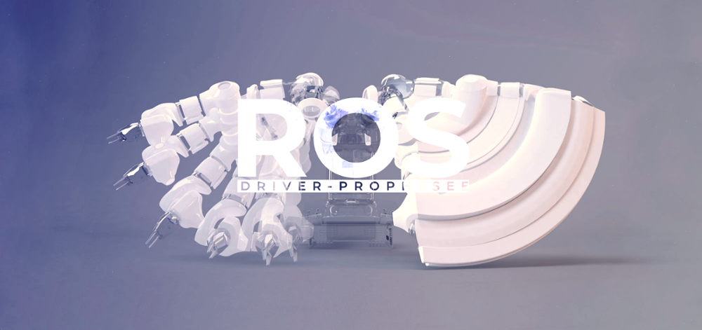

# Prophesee ROS Wrapper



The aim of this metapackage is wrapping event-based data from [Prophesee sensors](https://www.prophesee.ai/event-based-sensor-packaged) using [OpenEB](https://github.com/prophesee-ai/openeb) software and publishing the event-based data to ROS.

This metapackage contains ROS wrapper (prophesee_ros_driver) and messages (prophesee_event_msgs) for Prophesee sensors.

prophesee_ros_driver is a ROS wrapper including the following nodes:
  * prophesee_ros_publisher - publishing data from Prophesee sensor to ROS topics
  * prophesee_ros_viewer - listening data from ROS topics and visualizing them on a screen

prophesee_event_msgs package contains ROS message types for Prophesee event-based data, including:
  * Event - an event from a Prophesee camera (uint16 x, uint16 y, ros::Time ts, bool polarity)
  * EventArray - a buffer of events (Event[] events)

Supported [Prophesee Evaluation Kit Cameras](https://docs.prophesee.ai/stable/hw/evk/index.html) :
  * EVKV1 Gen3.0, Gen3.1, Gen4.1
  * EVKV2 Gen4.1
  * EVKV3 Gen3.1, Gen4.1
  * EVKV4 IMX636ES

## Requirements

  * Ubuntu 20.04 or 18.04
  * ROS Noetic or ROS Melodic
  * [OpenEB](https://github.com/prophesee-ai/openeb) - starting from v2.2.0

## Installation

First of all, retrieve and compile [OpenEB](https://github.com/prophesee-ai/openeb).

Install a plugin for your camera (plugins for Prophesee cameras are included in OpenEB starting from v3.0.0.

Then, compile the packages:

  * Clone the source code to your catkin workspace ([create a workspace](http://wiki.ros.org/catkin/Tutorials/create_a_workspace), if needed)

    ```
        cd catkin_ws/src
        git clone https://github.com/prophesee-ai/prophesee_ros_wrapper.git
        cd ..
    ```

  * Compile

    ```
        catkin_make
    ```

  * Source the workspace

    ```
        source ~/catkin_ws/devel/setup.bash
    ```
  
  

## Getting Started
  
### Publishing data from a camera and listening them 

To publish data from Prophesee camera to ROS topics, run:

  ```
        roslaunch prophesee_ros_driver prophesee_publisher.launch
  ```

The following topics will be published:

  * /prophesee/camera/cd_events_buffer - buffer of CD (Change Detection) events
  * /prophesee/camera/camera_info - information about the camera

To listen data from ROS topics and visualize them:

  ```
        roslaunch prophesee_ros_driver prophesee_viewer.launch
  ```

### Recording data from a live camera to rosbag

To record data from live camera to rosbag:
  * Start the publisher:

  ```
        roslaunch prophesee_ros_driver prophesee_publisher.launch
  ```

  * Start rosbag recording (choose the topics to record or record all available topics):

  ```
        rosbag record -a
  ```

### Publishing data from a RAW file

To publish data from RAW file to ROS topics and view the data:

  * Update the prophesee_publisher.launch file to set the path to your RAW file (i.e. raw_file_to_read parameter)

  ```
        rosed prophesee_ros_driver prophesee_publisher.launch
  ```

  * Start the ROS core

  ```
        roscore
  ```
  
  * Start the viewer, at first to be sure to not miss any data:

  ```
        roslaunch prophesee_ros_driver prophesee_viewer.launch
  ```

  * Start the publisher:

  ```
        roslaunch prophesee_ros_driver prophesee_publisher.launch
  ```

At the end of the RAW file, the publisher will stop on its own, but the viewer won't stop, so it's up to you to quit the viewer.

### Recording data from a RAW file to rosbag

To record data from RAW file to rosbag:

  * Update the prophesee_publisher.launch file to set the path to your RAW file (in raw_file_to_read parameter)

  ```
        rosed prophesee_ros_driver prophesee_publisher.launch
  ```

  * Start the ROS core

  ```
        roscore
  ```

  * Start rosbag recording (choose the topics to record or record all available topics):

  ```
        rosbag record -a
  ```

  * Start the publisher:

  ```
        roslaunch prophesee_ros_driver prophesee_publisher.launch
  ```

## Contact
The code is open to contributions, thus do not hesitate to propose pull requests or create/fix bug reports.
In case of any issue, please add it here on GitHub. 
For any other information [contact us](https://www.prophesee.ai/contact-us/).
